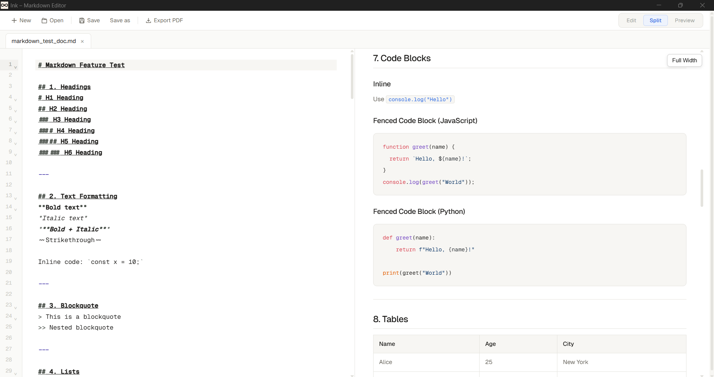

# Ink Markdown Editor

A modern, native Markdown editor built with [Tauri](https://tauri.app/) and React.  
Write, preview, and organize your documents with a clean, distraction‑free interface.



## ✨ Features

- **Tab management** – open multiple files, reorder tabs, drag & drop `.md` files into the window
- **Three viewing modes** – Edit, Preview, or Split (editor + live preview side‑by‑side)
- **Full‑featured editor** – CodeMirror 6 with syntax highlighting, line numbers, folding, and bracket matching
- **Live preview** – rendered HTML with support for **Mermaid diagrams**, task lists, and GFM
- **Find in document** – quick search (Ctrl+F) highlights and jumps to matches
- **File operations** – open, save, save as, export to PDF (via browser print)
- **Persistent state** – remembers cursor position, scroll position, and preview scroll per tab
- **Task list sync** – clicking a checkbox in the preview updates the actual Markdown source
- **Single instance** – opening a `.md` file from your OS focuses the existing window
- **Keyboard shortcuts** – Ctrl+S (save), Ctrl+Shift+S (save as), Ctrl+O (open), Ctrl+F (find), Esc (close find bar)

## 🧰 Tech Stack

| Layer         | Technologies                                                               |
| ------------- | -------------------------------------------------------------------------- |
| Frontend      | React 18, TypeScript, Zustand, CodeMirror 6, `@uiw/react-codemirror`       |
| Markdown      | `markdown-it` + plugins (Mermaid, task lists, etc.) – see `utils/markdown` |
| Styling       | plain CSS (no framework)                                                   |
| Backend       | Rust + Tauri v2                                                            |
| Tauri plugins | dialog, fs, shell, opener, single_instance                                 |

## 🚀 Getting Started

### Prerequisites

- [Node.js](https://nodejs.org/) (v18 or later)
- [Rust](https://www.rust-lang.org/tools/install) (latest stable)
- [Tauri CLI](https://tauri.app/v1/guides/getting-started/prerequisites) (install with `cargo install tauri-cli`)

### Installation

```bash
# Clone the repository
git clone https://github.com/Jishnu-Prasad888/Ink.git
cd Ink
# Install frontend dependencies
npm install
```

### Development

Run the app in development mode with hot‑reload:

```bash
npm run tauri dev
```

> The first build will take a few minutes because Tauri compiles the Rust backend.

### Building

Create a production bundle for your platform:

```bash
npm run tauri build
```

The executable will be located in `src-tauri/target/release/`.

## ⌨️ Keyboard Shortcuts

| Shortcut             | Action                        |
| -------------------- | ----------------------------- |
| `Ctrl+O`             | Open file(s)                  |
| `Ctrl+S`             | Save current file             |
| `Ctrl+Shift+S`       | Save as…                      |
| `Ctrl+F`             | Open find bar                 |
| `Esc`                | Close find bar                |
| `Ctrl+Tab` (browser) | Switch tabs (browser default) |

> `Ctrl` = `Cmd` on macOS.

## 📁 Project Structure

```
ink-markdown-editor/
├── src/                    # React frontend
│   ├── components/         # Editor, TabBar, MarkdownPreview, SplitView, Tab
│   ├── store/              # Zustand tab store
│   ├── utils/              # markdown rendering (markdown-it + Mermaid)
│   ├── App.tsx
│   └── main.tsx
├── src-tauri/              # Rust backend
│   ├── src/
│   │   ├── lib.rs          # Tauri commands (file dialogs, read/write)
│   │   └── main.rs
│   ├── Cargo.toml
│   └── tauri.conf.json
├── public/
└── package.json
```

## 🖱️ Drag & Drop

You can drag one or more `.md` / `.markdown` files directly into the application window.  
Each file will open in a new tab.

## 📄 Export to PDF

Use the **Export PDF** button in the toolbar or press `Ctrl+P` (browser print).  
From the print dialog you can “Save as PDF”.

## 🧪 Mermaid & Task Lists

- **Mermaid diagrams** – any code block labelled `mermaid` will be rendered as a diagram in the preview.
- **Task lists** – markdown like `- [ ] todo` / `- [x] done` becomes a clickable checkbox. Toggling it updates the source.

## 🤝 Contributing

Contributions are welcome! Please open an issue or pull request for any bugs or enhancements.

## 📝 License

MIT License
