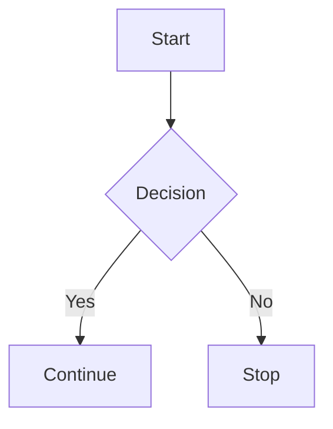

# Markdown Feature Test

## 1. Headings
# H1 Heading
## H2 Heading
### H3 Heading
#### H4 Heading
##### H5 Heading
###### H6 Heading

---

## 2. Text Formatting
**Bold text**  
*Italic text*  
***Bold + Italic***  
~~Strikethrough~~  

Inline code: `const x = 10;`

---

## 3. Blockquote
> This is a blockquote  
>> Nested blockquote

---

## 4. Lists

### Unordered List
- Item 1
- Item 2
  - Nested item
  - Another nested item

### Ordered List
1. First item
2. Second item
   1. Sub-item
   2. Sub-item

### Task List
- [x] Completed task
- [ ] Incomplete task

---

## 5. Links
[OpenAI](https://www.openai.com)  
<https://www.example.com>

---

## 6. Images


---

## 7. Code Blocks

### Inline
Use `console.log("Hello")`

### Fenced Code Block (JavaScript)
```javascript
function greet(name) {
  return `Hello, ${name}!`;
}
console.log(greet("World"));
```

### Fenced Code Block (Python)
```python
def greet(name):
    return f"Hello, {name}!"

print(greet("World"))
```

---

## 8. Tables

| Name   | Age | City      |
|--------|-----|----------|
| Alice  | 25  | New York |
| Bob    | 30  | London   |
| Charlie| 35  | Tokyo    |

---

## 9. Horizontal Rule
---
***
___

---

## 10. HTML Support
<div style="color: red;">
This is raw HTML inside Markdown.
</div>

---

## 11. Escaping Characters
\*This is not italic\*  
\# Not a heading

---

## 12. Footnotes
Here is a statement.[^1]

[^1]: This is the footnote.

---

## 13. Definition List (if supported)
Term
: Definition

---

## 14. Emoji (if supported)
:smile: :rocket: :fire:

---

## 15. Math (if supported)

Inline math: $E = mc^2$

Block math:
$$
\int_{a}^{b} x^2 \, dx
$$

---

## 16. Collapsible Section (GitHub style)
<details>
  <summary>Click to expand</summary>

  Hidden content here!

</details>

---

## 17. Highlight (if supported)
==Highlighted text==

---

## 18. Subscript / Superscript
H~2~O  
X^2^

---

## 19. Keyboard Input
Press <kbd>Ctrl</kbd> + <kbd>C</kbd>

---

## 20. Diagram (Mermaid, if supported)


---

## 21. Quotes & Mixed Formatting
> **Bold inside quote** and *italic* and `code`

---

## 22. Line Breaks
Line one  
Line two (two spaces above create a break)

---

## 23. Auto Linking
https://openai.com

---

## 24. Mixed Example
### Sample Card
> **Name:** John Doe  
> **Role:** Developer  
> - Skills:
>   - JavaScript
>   - Python
>   - Markdown

---

_End of Markdown Test File_